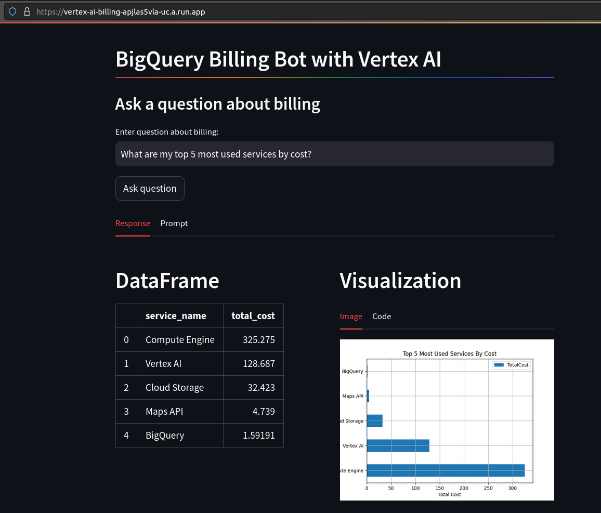

# Vertex AI x GCP Billing (BigQuery Exports)

This repository contains a service that can be deployed to Cloud Run to integrate Vertex AI's Gemini Pro model with Google Cloud Billing Exports in BigQuery to enable you to ask natural language questions about your billing data.

If you already have billing set up to be exported to BigQuery, everything you need to run this service is in this repository.

Instructions for getting the service built and deployed can be found at [docs/quick_start.md](docs/quick_start.md).

The automation and documentation in this repo is based on my [Generative AI](https://github.com/stevenaldinger/generative-ai) repo.

## WARNING

This is a proof of concept setup and is not securely deployed. The Cloud Run service will be publicly available, so if you try the demo, make sure to delete the service when you're done. You can do that with the `make terraform_destroy_vertex_ai_billing_service` command.

